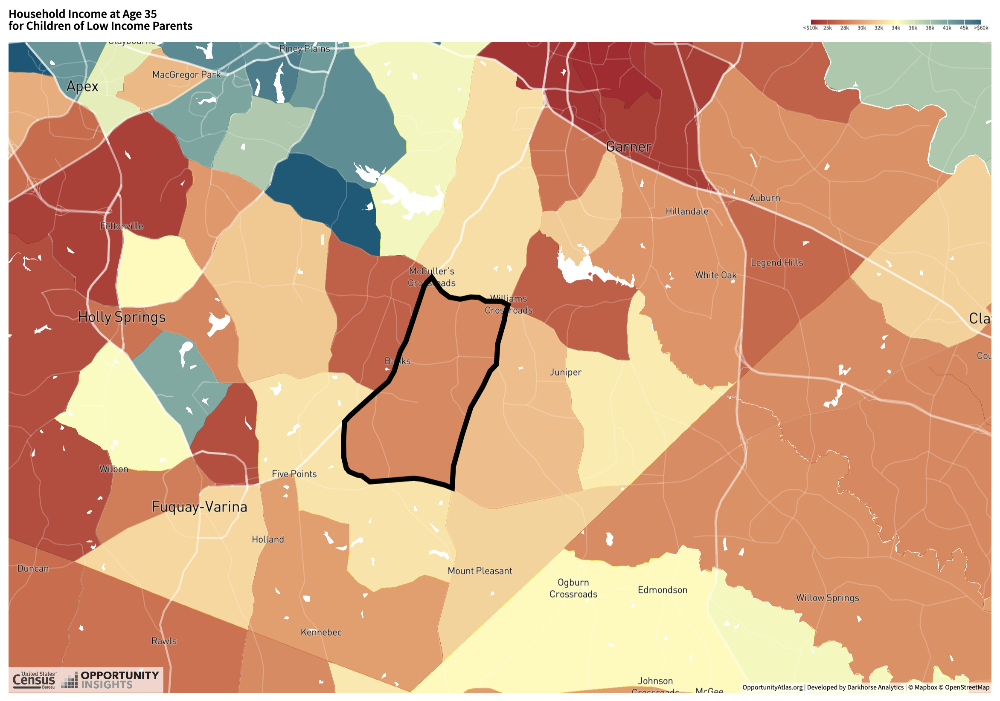

```{r setup, include=FALSE}
knitr::opts_chunk$set(echo = TRUE)
library(tidyverse)
library(haven)
library(ggthemes)
library(statar) 
library(tidyquant)
library(purrr)
library(sandwich)
library(lmtest)
library(tidyr)
atlas <- read_dta("atlas.dta")
view(atlas)


```

***Question 1***
My name is Jose and I am from Willow Spring, North Carolina. My community is on the southern edge of Wake County. The map below shows adult household income for children born to low income parents. Compared to similar children nationwide, my neighborhood has below average outcomes. 



```{r q2}

#Question 2: Summary statistics of all variables, including recording all missing values. 
summary(atlas)

```

Most variables have at least some number of missing values. Many of them lack values for almost all tracts, especially the variables that pool data at the household level for different racial groups. This may be because many racial tracts do not have enough people belonging to that racial group to collect enough aggregate data for that given variable.

***Question 3***
The `kfr_pooled_pooled_p25` variable calculates the mean percentile rank for household income for people born to parents at the 25th percentile of the national distribution of household income. In other words, the higher the value for this variable, the higher absolute mobility. This is calculated with using a linear model to capture the effect that being born to parents at the 25th percentile of household income will have on income outcomes as adults, pooled at the census tract level.  

```{r q4}

#Question 4: Histogram of Absolute Mobility at the 25th percentile 

absmob_histo <- atlas |> 
                ggplot() + 
                geom_histogram(aes(x = kfr_pooled_pooled_p25, y = after_stat(density))) + 
                labs(title = "Ranked Absolute Mobility at the 25th Percentile",
                     subtitle = "For household income 2014-15",
                     x = "Mean percentile rank ")
absmob_histo 

ggsave("absmob_histo.png")


```
The histogram shows an approximately normal distribution of mean percentile rank of absolute mobility at the 25th percentile, slightly left skewed. The majority of pooled census tract absolute mobility ranks are between 25 and 50. 

```{r q5}

#Question 5: Summary statistics for kfr_pooled_pooled_p25

sumstats <- summary(atlas$kfr_pooled_pooled_p25, na.rm = TRUE)
sdstats <- sd(atlas$kfr_pooled_pooled_p25, na.rm = TRUE)
#creating a table of those values 
sumstat <- data.frame(c("Min", "1st Qu.", "Median", "Mean", "3rd Qu.", "Max", "SD", "NAs"),
                       c(-3.286, 38.070, 42.520, 42.858, 47.350, 103.349, 7.126422, 1189))
names(sumstat)[1] <- "Summary Stats"
names(sumstat)[2] <- "Values"
sumstat <- sumstat |> 
          mutate(Values = round(Values, 2))
sumstat
```

***Question 6***
`kfr_pooled_pooled_p25` can be negative or above 100 in these data because of the limitations of a simple linear model. The model does not know that we are trying to create a standardized percentile rank variable that (logically) starts at 0 and ends at 100. It simply receives a variable (in this case, parents' percentile rank of national household income pooled at the census tract) and uses it to predict the values of a dependent variable (kid percentile rank of household income). Because we are working with a large dataset, it is natural that the model, even when using standardized percentile values, will report values that are below 0 and above 100. 

```{r q7}

#Question 7: comparing absolute mobiltiy at the 25th percentile in my census tract, state, and across the U.S.

usabsmob <- mean(atlas$kfr_pooled_pooled_p25, na.rm = TRUE) #mean of absolute mobility nationwide
ncabsmob <- mean(atlas$kfr_pooled_pooled_p25[atlas$state == "37"], na.rm = TRUE) #mean of absolute mobility in NC
myhood <- atlas %>% subset(state == "37" & county == "183" & tract == "53110") #creating data frame of just my tract
myhoodabsmob<- mean(myhood$kfr_pooled_pooled_p25, na.rm = TRUE) #mean of absolute mobility in my neighborhood

abscomp <- data.frame(c("My Neighborhood", "North Carolina", "United States"),
                       c(myhoodabsmob, ncabsmob, usabsmob))
names(abscomp)[1] <- "Level"
names(abscomp)[2] <- "Absolute Mobility at the 25th Percentile"
abscomp


```

My neighborhood/census tract has a slightly higher level of absolute mobility (at the 25th percentile) compared to my home state of North Carolina. Both my census tract and North Carolina have a lower level of absolute mobility than the national average.

```{r q8}

#Question 8: calculating and comparing standard deviations of absolute mobility in my home county, state, and nationwide

usasd <- sd(atlas$kfr_pooled_pooled_p25, na.rm = TRUE) #sd of absolute mobility nationwide
ncsd <- sd(atlas$kfr_pooled_pooled_p25[atlas$state == "37"], na.rm = TRUE) #sd of absolute mobility in NC
wake_co <- atlas %>% subset(state == "37" & county == "183") #creating data frame of just my tract
countysd<- sd(wake_co$kfr_pooled_pooled_p25, na.rm = TRUE) #sd of absolute mobility in my county

sdcomp <- data.frame(c("Wake County", "North Carolina", "United States"),
                       c(countysd, ncsd, usasd))
names(sdcomp)[1] <- "Level"
names(sdcomp)[2] <- "Std Dev of Absolute Mobility at the 25th Percentile"
sdcomp
```

The standard deviation of mobility outcomes for my Wake County, NC (7.69) is slightly higher than the standard deviation at the national level. North Carolina's mobility outcome standard deviation of 5.75 is lower than the amount of spread at the county or national level. This gives us a sense of how results may vary, which makes sense because of the increasing sample size for each successive level of analysis.

```{r q9}

#Question 9: plotting the relationship between upward mobility and rent in my neighborhood

#9a: Scatter plot of my home county

scatterrent <- atlas |> 
           filter(state == 37,
                  county == 183) |> 
           ggplot() +
           geom_point(aes(x = rent_twobed2015, y = kfr_pooled_pooled_p25)) +
           geom_smooth(aes(x = rent_twobed2015, y = kfr_pooled_pooled_p25), method = "lm", se = F) +
           labs(x = "Average Rent for Two-Bedroom Apt",
                y = "Absolute Mobility at the 25th Percentile",
                title = "Relationship between rent and absolute mobility in Wake County, NC") +
          scale_x_continuous(labels = scales::dollar_format()) 
scatterrent

ggsave("scatterrent.png")


```

***Question 9B***
There is an apparent positive correlation between rent and absolute mobility at the 25th percentile. The line of best fit suggests that as rent increases in my home county, the percentile rank of absolute mobility increases as well. This suggests that low income children living in higher-priced tracts experience higher mobility than low income children living in cheaper (and, presumably, more economicallly and socially disadvantaged) tracts. 

***Question 9C***
Opportunity bargains are neighborhoods with cheaper than average rents and above average absolute mobility outcomes. For this question, I am defining a given neighborhood an opportunity bargain if it has under $1500 in median two-bedroom rent and the highest percentile rank for absolute mobility at the 25th percentile for my given county. 

```{r q9c1}

#Question 9c: Defining Opportunity Bargains
myhood <- atlas %>% subset(state == "37" & county == "183" & tract == "53110") #creating data frame of just my tract
myhoodabsmob
myhoodrent <- mean(myhood$rent_twobed2015, na.rm = TRUE) #myneighborhood rent 
myhoodrent

```

With an absolute mobility rank (at the 25th percentile) of 38 and a median two-bedroom apartment rent of $710, my neighborhood can perhaps be considered an opportunity tract, but we would need to compare it to other tracts in my county to make a more practical judgment. What about other census tracts in my home county of Wake County?

```{r 9c2}

#Finding other opportunity bargains in my home county
wake_co <- atlas %>% subset(state == "37" & county == "183") #creating data frame of just my tract
wake_co$bargain_index <- wake_co$kfr_pooled_pooled_p25/wake_co$rent_twobed2015
wake_bargains <- wake_co |> 
                 select(tract_name, tract, kfr_pooled_pooled_p25, rent_twobed2015, bargain_index) |> 
                 arrange(desc(bargain_index))
print(wake_bargains)

```

Using the opportunity bargain index method derived by dividing the absolute mobility rank by the median two-bedroom rent, we see that my census tract is #21 out of the 186 tracts in my home county. Furthermore, we see that my tract's bargain index variable is influenced by the very cheap median rent in my neighborhood - but cheap rent alone does not make an opportunity bargain. Therefore, I would not classify my neighborhood/census tract as an opportunity bargain. I will go ahead and determine opportunity bargains those census tracts with rents under $1500 and an absolute mobility rank of over 50. Let's see where they are, if any.

```{r q9c3}

#Finding opportunity bargains in Wake County
top_bargains <- wake_bargains |> 
                filter(rent_twobed2015 <= 1500,
                       kfr_pooled_pooled_p25 >= 50)
print(top_bargains)

```
So now we see a list of 17 census tracts - from my experience, most of them clustered in the neighborhoods of upper middle-class North Raleigh and rapidly growing Cary - that we can reasonably say are opportunity bargains. Let's highlight them on the scatterplot of rent and absolute mobility to place them in the context of other census tracts. Do they stand out?

```{r 9c4}

#Highlighting opportunity bargains in Wake County, NC

scatterbargain <- atlas |> 
           filter(state == 37,
                  county == 183) |> 
           ggplot() +
           geom_point(aes(x = rent_twobed2015, y = kfr_pooled_pooled_p25)) +
           geom_point(data = top_bargains, aes(x = rent_twobed2015, y = kfr_pooled_pooled_p25),
                      color ="red", size = 3) +
           geom_text(aes(x = rent_twobed2015, y = kfr_pooled_pooled_p25, label = tract), check_overlap = TRUE,
                     size = 3, nudge_x = 2, nudge_y = 1) +
           geom_smooth(aes(x = rent_twobed2015, y = kfr_pooled_pooled_p25), method = "lm", se = F) +
           labs(x = "Average Rent for Two-Bedroom Apt",
                y = "Absolute Mobility at the 25th Percentile",
                title = "Relationship between rent and absolute mobility in Wake County, NC",
                subtitle = "Opportunity bargains highlighted in red") +
          scale_x_continuous(labels = scales::dollar_format()) 
scatterbargain

ggsave("scatterbargain.png")

```

And there they are! These are the bargain tracts with cheap rent and above average mobility outcomes in Wake County, NC.

```{r q10a1}

#Question 10: Tracking changes in Wake County over the last 20 years

#10A: scatter plot of poverty rate in 1990 and 2010 for Wake County 

wakepoverty <- atlas |> 
           filter(state == 37,
                  county == 183) |> 
           ggplot(aes(x = poor_share1990, y = poor_share2010)) +
           geom_point(aes(x = poor_share1990, y = poor_share2010)) +
           geom_smooth(method = "lm", se = F) +
           labs(x = "Poverty Rate in 1990",
                y = "Poverty rate in 2010",
                title = "Poverty Rate, 1990-2010 in Wake County, NC",
                subtitle = "Most tracts saw few changes in their poverty rate over time") 
wakepoverty

ggsave("wakepoverty.png")

```


```{r q10a2}

#10A: scatter plot of Black population in 1990 and 2010 for Wake County

wakeblack <- atlas |> 
           filter(state == 37,
                  county == 183) |> 
           ggplot(aes(x = share_black2000, y = share_black2010)) +
           geom_point() +
           geom_smooth(method = "lm", se = F) +
           labs(x = "Black population in 2000",
                y = "Black population in 2010",
                title = "Black population share 2000-2010 in Wake County, NC",
                subtitle = "Roughly equal number of census tracts saw their Black population share rise or fall over time") 
wakeblack

ggsave("wakeblack.png")

```


```{r q10a3}

#10A: scatter plot of Hispanic population in 1990 and 2010 for Wake County 

wakehisp <- atlas |> 
           filter(state == 37,
                  county == 183) |> 
           ggplot(aes(x = share_hisp2000, y = share_hisp2010)) +
           geom_point() +
           geom_smooth(method = "lm", se = F) +
           labs(x = "Hispanic population in 2000",
                y = "Hispanic population in 2010",
                title = "Hispanic population share 2000-2010 in Wake County, NC",
                subtitle = "Several tracts saw their Hispanic population grow significantly over time") 
wakehisp

ggsave("wakehisp.png")
```


```{r q10a4}

#10A: scatter plot of Asian population in 1990 and 2010 for Wake County 

wakeasian <- atlas |> 
           filter(state == 37,
                  county == 183) |> 
           ggplot(aes(x = share_asian2000, y = share_asian2010)) +
           geom_point() +
           geom_smooth(method = "lm", se = F) +
           labs(x = "Asian population in 2000",
                y = "Asian population in 2010",
                title = "Asian population share 2000-2010 in Wake County, NC",
                subtitle = "Select number of tracts saw their Asian population more than double over time") 
wakeasian

ggsave("wakeasian.png")
```


```{r q10a5}

#10A: scatter plot of White population in 1990 and 2010 for Wake County 

wakewhite <- atlas |> 
           filter(state == 37,
                  county == 183) |> 
           ggplot(aes(x = share_white2000, y = share_white2010)) +
           geom_point() +
           geom_smooth(method = "lm", se = F) +
           labs(x = "White population in 2000",
                y = "White population in 2010",
                title = "White population share 2000-2010 in Wake County, NC",
                subtitle = "Several tracts are no longer majority white") 
wakewhite

ggsave("wakewhite.png")

```
***Question 10B***
Between 1990, 2000, and 2010, Wake County saw relatively minor changes to its poverty rate, but significant changes to its demographic composition. Most tracts saw fairly little change in their poverty rate between 1990 and 2010. However, several tracts saw significant increases in their share of Asian and Hispanic populations between 2000 and 2010. At the same time, many tracts saw their share of the White population fall under 50%. This highlights the growing share of nonwhite populations in Wake County over the last few decades.

```{r q11}

#Question 11a: Average absolute mobility rate for neighborhoods grouped by HOLC grade (A, B, C, and D)

holcmobil <- atlas |> 
             mutate(grade = case_when(HOLC_A > 0.5 & !is.na(HOLC_A) ~ 'A',
                                      HOLC_B > 0.5 & !is.na(HOLC_B) ~ 'B',
                                      HOLC_C > 0.5 & !is.na(HOLC_C) ~ 'C',
                                      HOLC_D > 0.5 & !is.na(HOLC_D) ~ 'D')) |> 
            group_by(grade) |> 
            summarize(mean_absolute_mobility = mean(kfr_pooled_pooled_p25, na.rm = TRUE))
                      
holcmobil
                     

```
There is a clear pattern of increasing upward mobility for children born in the 1980s in Census tracts with higher 1930s HOLC grades. For tracts where a majority of its area was graded A, the average mobility rank at the 25th percentile is roughly 44. As we start to look at tracts with majority of their areas graded B through D, we see a consistent pattern of a decrease of 2-3 mobility percentile ranks. This suggests that practices such as redlining may have had an adverse effect on mobility outcomes in various neighborhoods that persists to this day. 

```{r q11b}

#Q 11b: Black population share in 2000 for neighborhoods grouped by HOLC grade

holcblack <- atlas |> 
             mutate(grade = case_when(HOLC_A > 0.5 & !is.na(HOLC_A) ~ 'A',
                                      HOLC_B > 0.5 & !is.na(HOLC_B) ~ 'B',
                                      HOLC_C > 0.5 & !is.na(HOLC_C) ~ 'C',
                                      HOLC_D > 0.5 & !is.na(HOLC_D) ~ 'D')) |> 
            group_by(grade) |> 
            summarize(mean_blackpop = mean(share_black2000, na.rm = TRUE))
                      
holcblack 

```
It is clear that when looking at the racial composition of HOLC graded neighborhoods, we see that neighborhoods graded A have less than half of Black population share as we see in D rated neighborhoods. There is a clear pattern of increasing Black population share as we move across neighborhoods by their HOLC grade. We cannot rule out race as a confounding variable in driving mobility outcomes. 

```{r q11c}

#Q11C: Average of Black and White pooled absolute mobility for neighborhoods grouped by HOLC grade

holcracefixed <- atlas |> 
             mutate(grade = case_when(HOLC_A > 0.5 & !is.na(HOLC_A) ~ 'A',
                                      HOLC_B > 0.5 & !is.na(HOLC_B) ~ 'B',
                                      HOLC_C > 0.5 & !is.na(HOLC_C) ~ 'C',
                                      HOLC_D > 0.5 & !is.na(HOLC_D) ~ 'D')) |> 
            group_by(grade) |> 
            summarize(mean_blackmobil = mean(kfr_black_pooled_p25, na.rm = TRUE),
                      mean_whitemobil = mean(kfr_white_pooled_p25, na.rm = TRUE))
                      
holcracefixed 


```
When we look at absolute mobility rates by HOLC neighborhood grade and race, racial composition cannot be a confounder in this analysis because we are isolating racial variables. When we look solely at Black mobility rates or white mobility rates, we are looking solely at Black child outcomes, so the potential effect that former HOLC neighborhood grade may have on mobility outcomes should be more clear.

Looking at Black and white pooled mobility rates, it's evident that mobility percentile ranks decrease as neighborhood HOLC grades decrease. There is a decrease of roughly 3 percentile ranks for Black children's mobility outcomes between grade A and D neighborhoods. Similarly, there is a decrease of roughly 6 percentile ranks for White children's outcomes between A and D neighborhoods. What's notable is that the average mobility rank for white children living in D neighborhoods remains higher (44 vs. 34) than the average mobility rank for Black children who lived in A neighborhoods. Clearly, HOLC grade and race have separate but similar impacts on mobility outcomes. 

```{r q11d}

#Q11D: Analyzing potential causal relationship between HOLC neighborhood grade and vegetation, extreme heat, and land area development

holccausal <- atlas |> 
             mutate(grade = case_when(HOLC_A > 0.5 & !is.na(HOLC_A) ~ 'A',
                                      HOLC_B > 0.5 & !is.na(HOLC_B) ~ 'B',
                                      HOLC_C > 0.5 & !is.na(HOLC_C) ~ 'C',
                                      HOLC_D > 0.5 & !is.na(HOLC_D) ~ 'D')) |> 
            group_by(grade) |> 
            summarize(mean_veg = mean(vegetation, na.rm = TRUE),
                      mean_heat = mean(extreme_heat, na.rm = TRUE),
                      mean_developed = mean(developed, na.rm = TRUE))
                      
holccausal

```
The analysis shows that neighborhoods with higher HOLC grades have more vegetation, lower extreme heat temperatures, and slightly less developed land (all three variables relative to a baseline). While all graded neighborhood levels have lower levels of vegetation than the baseline (which makes sense, since graded neighborhoods were more likely to be in urban areas), the level of vegetation gets lower with each decreasing HOLC grade. As HOLC grades decrease, there is a rise in extreme land surface heat during summer. Finally, while all graded tracts are fairly highly developed, lower graded tracts have higher rates of land development. This suggests that factors like less green space and investment in public parks are a legacy of redlining, and potentially contributing to lower mobility outcomes today. 

```{r q11e}

#Q11E: Visualizing variables means affected by HOLC neighborhood grades 

#Absolute mobility pooled for all races and genders, grouped by HOLC neighborhood grade

mobilgraph <- atlas |> 
             mutate(grade = case_when(HOLC_A > 0.5 & !is.na(HOLC_A) ~ 'A',
                                      HOLC_B > 0.5 & !is.na(HOLC_B) ~ 'B',
                                      HOLC_C > 0.5 & !is.na(HOLC_C) ~ 'C',
                                      HOLC_D > 0.5 & !is.na(HOLC_D) ~ 'D')) |> 
            group_by(grade) |> 
            summarize(mean_absolute_mobility = mean(kfr_pooled_pooled_p25, na.rm = TRUE)) |> 
            ggplot(aes(x = grade, y = mean_absolute_mobility, fill = grade)) +
            geom_bar(stat = "identity", show.legend = TRUE, width = 0.6) +
            scale_fill_manual(values = c("tomato1", "tomato2", "tomato3", "tomato4")) +
            labs(x = "",
                 y = "Absolute Mobility at the 25th Percentile",
                 title = "Absolute Mobility Across all Racial Groups and Genders",
                 fill = "HOLC Grade") +
            theme_clean()
            
mobilgraph

ggsave("mobilgraph.png")
```
```{r q11f}

#Visualizing Black population share across census tracts grouped by HOLC neighborhood grade

holcblackgraph <- atlas |> 
             mutate(grade = case_when(HOLC_A > 0.5 & !is.na(HOLC_A) ~ 'A',
                                      HOLC_B > 0.5 & !is.na(HOLC_B) ~ 'B',
                                      HOLC_C > 0.5 & !is.na(HOLC_C) ~ 'C',
                                      HOLC_D > 0.5 & !is.na(HOLC_D) ~ 'D')) |> 
            group_by(grade) |> 
            summarize(mean_blackpop = mean(share_black2000, na.rm = TRUE))|> 
            ggplot(aes(x = grade, y = mean_blackpop, fill = grade)) +
            geom_bar(stat = "identity", show.legend = TRUE, width = 0.6) +
            scale_fill_manual(values = c("tomato1", "tomato2", "tomato3", "tomato4")) +
            labs(x = "",
                 y = "Black Population Share",
                 title = "Black Population Share by HOLC Grade",
                 fill = "HOLC Grade") +
            theme_clean()
            
holcblackgraph

ggsave("holcblackgraph.png")

```

```{r q11g}

#Visualizing Black and White pooled absolute mobility for neighborhoods grouped by HOLC grade

#Black mobility by HOLC graded neighborhood
blackmobilgraph <- atlas |> 
             mutate(grade = case_when(HOLC_A > 0.5 & !is.na(HOLC_A) ~ 'A',
                                      HOLC_B > 0.5 & !is.na(HOLC_B) ~ 'B',
                                      HOLC_C > 0.5 & !is.na(HOLC_C) ~ 'C',
                                      HOLC_D > 0.5 & !is.na(HOLC_D) ~ 'D')) |> 
            group_by(grade) |> 
            summarize(mean_blackmobil = mean(kfr_black_pooled_p25, na.rm = TRUE),
                      mean_whitemobil = mean(kfr_white_pooled_p25, na.rm = TRUE)) |> 
            ggplot() +
            geom_bar(aes(x = grade, y = mean_blackmobil, fill = grade), stat = "identity", show.legend = TRUE, width = 0.6) +
            scale_fill_manual(values = c("tomato1", "tomato2", "tomato3", "tomato4")) +
            labs(x = "",
                 y = "Absolute Mobility at the 25th Percentile",
                 title = "Black Absolute Mobility by HOLC Grade",
                 fill = "HOLC Grade") +
            theme_clean()
                      
blackmobilgraph
ggsave("blackmobilgraph.png")

#White mobility by HOLC graded neighborhood
whitemobilgraph <- atlas |> 
             mutate(grade = case_when(HOLC_A > 0.5 & !is.na(HOLC_A) ~ 'A',
                                      HOLC_B > 0.5 & !is.na(HOLC_B) ~ 'B',
                                      HOLC_C > 0.5 & !is.na(HOLC_C) ~ 'C',
                                      HOLC_D > 0.5 & !is.na(HOLC_D) ~ 'D')) |> 
            group_by(grade) |> 
            summarize(mean_blackmobil = mean(kfr_black_pooled_p25, na.rm = TRUE),
                      mean_whitemobil = mean(kfr_white_pooled_p25, na.rm = TRUE)) |> 
            ggplot(aes(x = grade, y = mean_whitemobil, fill = grade)) +
            geom_bar(stat = "identity", show.legend = TRUE, width = 0.6) +
            scale_fill_manual(values = c("tomato1", "tomato2", "tomato3", "tomato4")) +
            labs(x = "",
                 y = "Absolute Mobility at the 25th Percentile",
                 title = "White Absolute Mobility by HOLC Grade",
                 fill = "HOLC Grade") +
            theme_clean()
                      
whitemobilgraph
ggsave("whitemobilgraph.png")


```

```{r q11h}

#Visualizing vegetation by HOLC neighborhood grade

veggraph <- atlas |> 
             mutate(grade = case_when(HOLC_A > 0.5 & !is.na(HOLC_A) ~ 'A',
                                      HOLC_B > 0.5 & !is.na(HOLC_B) ~ 'B',
                                      HOLC_C > 0.5 & !is.na(HOLC_C) ~ 'C',
                                      HOLC_D > 0.5 & !is.na(HOLC_D) ~ 'D')) |> 
            group_by(grade) |> 
            summarize(mean_veg = mean(vegetation, na.rm = TRUE),
                      mean_heat = mean(extreme_heat, na.rm = TRUE),
                      mean_developed = mean(developed, na.rm = TRUE)) |> 
            ggplot(aes(x = grade, y = mean_veg, fill = grade)) +
            geom_bar(stat = "identity", show.legend = TRUE, width = 0.6) +
            scale_fill_manual(values = c("tomato1", "tomato2", "tomato3", "tomato4")) +
            labs(x = "",
                 y = "Change in Normalized Difference Vegetation Index",
                 title = "Difference in Vegetation by HOLC Grade",
                 subtitle = "Relative to baseline",
                 fill = "HOLC Grade") +
            theme_clean()
                      
veggraph

ggsave("veggraph.png")


```


```{r q11i}

#Visualizing extreme summer daytime heat by HOLC grade

heatgraph <- atlas |> 
             mutate(grade = case_when(HOLC_A > 0.5 & !is.na(HOLC_A) ~ 'A',
                                      HOLC_B > 0.5 & !is.na(HOLC_B) ~ 'B',
                                      HOLC_C > 0.5 & !is.na(HOLC_C) ~ 'C',
                                      HOLC_D > 0.5 & !is.na(HOLC_D) ~ 'D')) |> 
            group_by(grade) |> 
            summarize(mean_veg = mean(vegetation, na.rm = TRUE),
                      mean_heat = mean(extreme_heat, na.rm = TRUE),
                      mean_developed = mean(developed, na.rm = TRUE)) |> 
            ggplot(aes(x = grade, y = mean_heat, fill = grade)) +
            geom_bar(stat = "identity", show.legend = TRUE, width = 0.6) +
            scale_fill_manual(values = c("tomato1", "tomato2", "tomato3", "tomato4")) +
            labs(x = "",
                 y = "Extreme Heat",
                 title = "Extreme Summer Daytime Urban Heat",
                 subtitle = "Relative to baseline",
                 fill = "HOLC Grade") +
            theme_clean()
                      
heatgraph

ggsave("heatgraph.png")


```
```{r q11j}
#Visualizing land development by HOLC grade

devgraph <- atlas |> 
             mutate(grade = case_when(HOLC_A > 0.5 & !is.na(HOLC_A) ~ 'A',
                                      HOLC_B > 0.5 & !is.na(HOLC_B) ~ 'B',
                                      HOLC_C > 0.5 & !is.na(HOLC_C) ~ 'C',
                                      HOLC_D > 0.5 & !is.na(HOLC_D) ~ 'D')) |> 
            group_by(grade) |> 
            summarize(mean_veg = mean(vegetation, na.rm = TRUE),
                      mean_heat = mean(extreme_heat, na.rm = TRUE),
                      mean_developed = mean(developed, na.rm = TRUE)) |> 
            ggplot(aes(x = grade, y = mean_developed, fill = grade)) +
            geom_bar(stat = "identity", show.legend = TRUE, width = 0.6) +
            scale_fill_manual(values = c("tomato1", "tomato2", "tomato3", "tomato4")) +
            labs(x = "",
                 y = "Fraction of Land Area Developed",
                 title = "Land Development by HOLC Grade",
                 fill = "HOLC Grade") 
                      
devgraph

ggsave("devgraph.png")


```
```{r q12}

#Question 12: Tracking air pollution via particulate matter changes over time 

pm82 <- mean(atlas$pm25_1982, na.rm = TRUE)
pm90 <- mean(atlas$pm25_1990, na.rm = TRUE)
pm00 <- mean(atlas$pm25_2000, na.rm = TRUE)
pm10 <- mean(atlas$pm25_2010, na.rm = TRUE)

airpollution <- data.frame(c("1982", "1990", "2000", "2010"),
                           c(pm82, pm90, pm00, pm10))
names(airpollution)[1] <- "Year"
names(airpollution)[2] <- "Particulate Matter Level"
airpollution

```

We see that air pollution, as measured by the particulate matter level data, has steadily decreased in the United States since 1982, with an average decrease of about 4 units fine particulate matter every 10 years. 

```{r q12b}

#Q12B: Comparing air pollution in my home Census tract, state, and nationwide

myhood <- atlas %>% subset(state == "37" & county == "183" & tract == "53110") #creating data frame of just my tract
myhoodap <- mean(myhood$pm25_1990, na.rm = TRUE)
ncap <- mean(atlas$pm25_1990[atlas$state == "37"], na.rm = TRUE)
usap <- mean(atlas$pm25_1990, na.rm = TRUE)

apcomp <- data.frame(c("My Census Tract", "North Carolina", "United States"),
                       c(myhoodap, ncap, usap))
names(apcomp)[1] <- "Level"
names(apcomp)[2] <- "PM Concentration"
apcomp


```

We see that the national air pollution average in 1990 was approximately 16.84 PM units, with higher concentrations of particulate matter for my home tract (17.37), and even higher for my home state of North Carolina (18.58). 

```{r q12c}

#Q12C: Visualizing the relationship between absolute mobility and air pollution in 1990 

scatterap <- atlas |> 
             ggplot(aes(x = pm25_1990, y = kfr_pooled_pooled_p25)) +
             stat_binmean(n = 50) +
             stat_smooth(method = "lm", se = FALSE) +
             labs(title = "Relationship between air pollution levels and absolute mobility",
                  x = "Concentration of ambient fine particulate matter (PM 2.5) in 1990",
                  y = "Absolute Mobility at the 25th percentile") 

scatterap

ggsave("scatterap.png")

```

```{r q12d}

#Q12D: Deriving the correlation coefficient between absolute mobility and air pollution in 1990

cor(atlas$kfr_pooled_pooled_p25, atlas$pm25_1990, use = "complete.obs")

```

The correlation coefficient between absolute mobility at the 25th percentile and air pollution levels in 1990 is approximately -0.18. This is smaller than the correlation at the county level. This makes sense because data grouped at the tract level leads to a larger sample size than data grouped at the county level. With a larger sampel size, variability increases, leading to a reduced correlation coefficient. 

```{r q13a}

#Q13A: Visualizing the relationship between strongly related covariates and absolute mobility

#Covariate 1: Incarceration Rate
wakeco <- atlas |> 
          filter(state == 37,
                 county == 183) #creating data frame of just my home county 

scatterjail <- wakeco |> 
             ggplot(aes(x = jail_pooled_pooled_p25, y = kfr_pooled_pooled_p25)) +
             stat_binmean(n = 50) +
             stat_smooth(method = "lm", se = FALSE) +
             labs(title = "Relationship between incarceration rate and absolute mobility in Wake County",
                  subtitle = "At the 25th percentile",
                  x = "Fraction incarcerated for children from families at the 25th percentile, 2010",
                  y = "Absolute Mobility at the 25th percentile") 

scatterjail

ggsave("scatterjail.png")

#Covariate 2: Median household income

scatterincome <- wakeco |> 
             ggplot(aes(x = med_hhinc1990, y = kfr_pooled_pooled_p25)) +
             stat_binmean(n = 50) +
             stat_smooth(method = "lm", se = FALSE) +
             labs(title = "Relationship between mean household income and absolute mobility in Wake County",
                  x = "Median household income in 1990 ",
                  y = "Absolute Mobility at the 25th percentile") 

scatterincome

ggsave("scatterincome.png")

#Covariate 3: Average Commute Time in 2000

scattercommute <- wakeco |> 
             ggplot(aes(x = mean_commutetime2000, y = kfr_pooled_pooled_p25)) +
             stat_binmean(n = 50) +
             stat_smooth(method = "lm", se = FALSE) +
             labs(title = "Relationship between mean work commute time and absolute mobility in Wake County",
                  x = "Average Commute Time of Working Adults in 2000",
                  y = "Absolute Mobility at the 25th percentile") 

scattercommute

ggsave("scattercommute.png")

```

```{r q13b}

#Q13B: Reporting correlation coefficients of covariates with absolute mobility 

jailcorcoef <- cor(wakeco$kfr_pooled_pooled_p25, wakeco$jail_pooled_pooled_p25, use = "complete.obs")
inccorcoef <- cor(wakeco$kfr_pooled_pooled_p25, wakeco$med_hhinc1990, use = "complete.obs")
commutecorcoef <- cor(wakeco$kfr_pooled_pooled_p25, wakeco$mean_commutetime2000, use = "complete.obs")

coefcomp <- data.frame(c("Incarceration Rate 2010", "Median Household Income 1990", "Mean Commute Time 2000"),
                       c(jailcorcoef, inccorcoef, commutecorcoef))
names(coefcomp)[1] <- "Covariate"
names(coefcomp)[2] <- "Correlation Coefficient with absolute mobility"
coefcomp


```

We see that there are negative correlations between the incarceration rate and the mean commute time and absolute mobility, respectively, and a fairly strong positive correlation between median household income (in 1990) and absolute mobility. 

```{r q14}

#Q14: Examining the relationship between covariates and absolute mobility by race and gender

#Incarceration Rate: We will look at incarceration rates for Black males, Hispanic males, and White males, and see the relationship between that covariate and absolute mobility outcome for each of these racial/gender groups in Wake County 

#Black Males

jailblack <- wakeco |> 
             ggplot(aes(x = jail_black_male_p25, y = kir_black_male_p25)) +
             stat_binmean(n = 50) +
             stat_smooth(method = "lm", se = FALSE) +
             labs(title = "Relationship between incarceration rate and absolute mobility for Black males in Wake County",
                  subtitle = "At the 25th percentile",
                  x = "Fraction of Black males incarcerated for children from families at the 25th percentile, 2010",
                  y = "Absolute Mobility for Black males at the 25th percentile") 
jailblack

ggsave("jailblack.png")

#White Males

jailwhite <- wakeco |> 
             ggplot(aes(x = jail_white_male_p25, y = kir_white_male_p25)) +
             stat_binmean(n = 50) +
             stat_smooth(method = "lm", se = FALSE) +
             labs(title = "Relationship between incarceration rate and absolute mobility for White males in Wake County",
                  subtitle = "At the 25th percentile",
                  x = "Fraction of White males incarcerated for children from families at the 25th percentile, 2010",
                  y = "Absolute Mobility for White males at the 25th percentile") 
jailwhite

ggsave("jailwhite.png")

#Hispanic Males

jailhisp <- wakeco |> 
             ggplot(aes(x = jail_hisp_male_p25, y = kir_hisp_male_p25)) +
             stat_binmean(n = 50) +
             stat_smooth(method = "lm", se = FALSE) +
             labs(title = "Relationship between incarceration rate and absolute mobility for Hispanic males in Wake County",
                  subtitle = "At the 25th percentile",
                  x = "Fraction of Hispanic males incarcerated for children from families at the 25th percentile, 2010",
                  y = "Absolute Mobility for Hispanic males at the 25th percentile") 
jailhisp

ggsave("jailhisp.png")

#Median Household Income: Next, we will look at median household income in 1990 and absolute mobility for Black, White, Hispanic, and Asian groups in Wake County 

#Black Children
blackincome <- wakeco |> 
             ggplot(aes(x = med_hhinc1990, y = kfr_black_pooled_p25)) +
             stat_binmean(n = 50) +
             stat_smooth(method = "lm", se = FALSE) +
             labs(title = "Relationship between mean household income and absolute mobility for Black people in Wake County",
                  x = "Median household income in 1990 ",
                  y = "Absolute Mobility for Black people at the 25th percentile") 

blackincome

ggsave("blackincome.png")

#White Children
whiteincome <- wakeco |> 
             ggplot(aes(x = med_hhinc1990, y = kfr_white_pooled_p25)) +
             stat_binmean(n = 50) +
             stat_smooth(method = "lm", se = FALSE) +
             labs(title = "Relationship between mean household income and absolute mobility for White people in Wake County",
                  x = "Median household income in 1990 ",
                  y = "Absolute Mobility for White people at the 25th percentile") 

whiteincome

ggsave("whiteincome.png")

#Hispanic Children 
hispincome <- wakeco |> 
             ggplot(aes(x = med_hhinc1990, y = kfr_hisp_pooled_p25)) +
             stat_binmean(n = 50) +
             stat_smooth(method = "lm", se = FALSE) +
             labs(title = "Relationship between mean household income and absolute mobility for Hispanics in Wake County",
                  x = "Median household income in 1990 ",
                  y = "Absolute Mobility for Hispanics at the 25th percentile") 

hispincome

ggsave("hispincome.png")

#Asian Children
asianincome <- wakeco |> 
             ggplot(aes(x = med_hhinc1990, y = kfr_asian_pooled_p25)) +
             stat_binmean(n = 50) +
             stat_smooth(method = "lm", se = FALSE) +
             labs(title = "Relationship between mean household income and absolute mobility for Asians in Wake County",
                  x = "Median household income in 1990",
                  y = "Absolute Mobility for Asians at the 25th percentile") 

asianincome

ggsave("asianincome.png")

```


```{r q14b}

#Q14 part 2: Reporting correlation coefficients of covariates with absolute mobility across race and gender 

jailblackcorcoef <- cor(wakeco$kir_black_male_p25, wakeco$jail_black_male_p25, use = "complete.obs")
jailwhitecorcoef <- cor(wakeco$kir_white_male_p25, wakeco$jail_white_male_p25, use = "complete.obs")
jailhispcorcoef <- cor(wakeco$kir_hisp_male_p25, wakeco$jail_hisp_male_p25, use = "complete.obs")
incblackcorcoef <- cor(wakeco$kfr_black_pooled_p25, wakeco$med_hhinc1990, use = "complete.obs")
incwhitecorcoef <- cor(wakeco$kfr_white_pooled_p25, wakeco$med_hhinc1990, use = "complete.obs")
inchispcorcoef <- cor(wakeco$kfr_hisp_pooled_p25, wakeco$med_hhinc1990, use = "complete.obs")
incasiancorcoef <- cor(wakeco$kfr_asian_pooled_p25, wakeco$med_hhinc1990, use = "complete.obs")

coefcomp_incarcerate <- data.frame(c("Incarceration Rate for Black Males", "Incarceration Rate for White Males", "Incarceration Rate for Hispanic Males"),
                       c(jailblackcorcoef, jailwhitecorcoef, jailhispcorcoef))
names(coefcomp_incarcerate)[1] <- "Incarceration Rate for Racial Group"
names(coefcomp_incarcerate)[2] <- "Correlation Coefficient with Absolute Mobility for that Racial Group"
coefcomp_incarcerate

coefcomp_medinc <- data.frame(c("Median Household Income 1990", "Median Household Income 1990", "Median Household Income 1990", "Median Household Income 1990"),
                              c("Black Absolute Mobility", "White Absolute Mobility", "Hispanic Absolute Mobility", "Asian Absolute Mobility"),
                              c(incblackcorcoef, incwhitecorcoef, inchispcorcoef, incasiancorcoef))
names(coefcomp_medinc)[1] <- "Covariate"
names(coefcomp_medinc)[2] <- "Absolute Mobility Group"
names(coefcomp_medinc)[3] <- "Correlation Coefficient with Absolute Mobility for that Racial Group"
coefcomp_medinc

```
When examining the relationship between incarceration rates and absolute mobility across race and gender, we see a fairly strong negative correlation coefficient between the black male incarceration rate and the absolute mobility for black males (-0.33). We see a weaker negative correlation coefficient between said covariates for white males (-0.05), and the sample size for hispanic males in Wake County is too small for us to consider the correlation coefficient for that racial group (0.48).

There is a clear pattern of fairly strong positive correlation coefficients between the median household income in 1990 and absolute mobility ranks for Blacks, Whites, Hispanics, and Asians. However, we should discount the correlation coefficient for Asian absolute mobility due to its small sample size. We should also note the difference between the correlation coefficient for Blacks' absolute mobility and the median household income (0.31) and that for Whites and Hispanics (0.452 and 0.458 respectively) - suggesting that, at least for Black children growing up in Wake County, there isn't as strong of a relationship between median household and their absolute mobility outcomes.

